Author: Cari Gostic

Email: cgostic@sonomatech.com

# Overview

The purpose of this package is to standardize layout and coloring of RShiny dashboards
and graphs created by Sonomatech, and to abstract away the details of plotting
and reactivity for widely used plots and tab options to make development more
efficient. 

The package contains the following functions:

- Color palettes
  - sonoma_color_palette()
  - sonoma_cb_color_palette()
  - tab_color_palette()
- GGplot elements
  - theme_sonoma()
  - scale_color_sonoma()
  - scale_fill_sonoma()
  - tbd: scale_color_cont_sonoma()
- Shiny dashboard functions
  - boxplotUI/Server()
  - boxplotModUI/Server()
  - detectionLimitsPlotUI/Server()
  - lineplotUI/Server()
  - networkCompletenessUI/Server()
  - pollutionRoseUI/Server()
  - pollutionRoseTabUI/Server()
  - scatterUI/Server()
  - sitemapUI/Server()
  - tableUI/Server()
  - timeseriesUI/Server()
  - timeseriesInvestigationTabUI/Server()
  - mapSelectHeaderUI/()
  - tabColorKeyUI/Server()
- Other
  - dashboard_template() (creates code template)
  - open_and_write() (internal)
  
<br><br>

# Install library

1) Download from Github

**Contact cgostic@sonomatech.com for the secret key needed to download from her github account.**

In an R console, execute the following command (substituting <token> for secret key):

```
devtools::install_github('cgostic/sonomaDashboardUI', auth_token = <token>)
```

2) Load package! 

```
library(sonomaDashboardUI)
```

<br><br><br><br>

# Access Example Data

Data shown in the examples below is processed NCore Data stored in an **.RData file**.

It may be copied to your local machine from here:

`\\FileServ1\shares\STIShare\ProjectDocs\920107 EPA Continued Development of DART and Visual Assessments of Data Quality\QA_Dashboards\data`

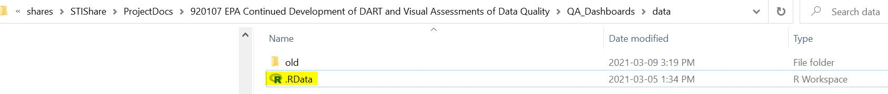

Copy the .RData file into the cloned sonomaDashboardUI repository on your machine.

Load the data into your global environment by executing the following in an r console:

```
load('.RData')
```

<br><br><br><br>

# dashboard_template()

Opens .R file and writes template for app with title header and tabset.

### Docstring Parameters

```
#' @param filename string Name of file (should follow format app_*.R). Must not
#'                        already exist.
#' @param tab_num integer Number of tabs
#' @param tab_names character vector Names of tabs
#' @param tab_groups integer vector (optional) Desired tab groupings. Each group 
#'                                  will have a unique color. Must sum to 
#'                                  tab_num. e.g. tab_num = 5, valid tab_groups
#'                                  include c(2,3), c(1,4), c(3,2), etc. If no
#'                                   tab groups are specified (default), all
#'                                    tabs will be the same color.
#' @param app_title string (optional) Title of App to be written in header. 
#'                         If not specified, title is blank.
#' @param header_img string (optional) Filename of image to include in title 
#'                          header. Must be in directory named www.If not 
#'                          specified, no image is added.
#' @param readme_file string (optional) Filename of README file. Must be in the
#'                           www folder.
#' @param PAL string (optional) The name of the non-colorblind-palette function
#'                   to use (default = sonoma_color_palette)
#' @param CB_PAL string (optional) The name of the colorblind-palette function
#'                      to use (default = sonoma_color_palette)
#' @param PAL_a double (optional) An alpha value between 0 and 1 to set opacity 
#'                                (default = 1)
```

**Must be used in RStudio.**


### Examples

<br>

**Example 1**

- App with 4 tabs, the first colored 1st color in palette (blue), and the other 3 colored 2nd color in palette (green)
- README_NCORE.pdf must be in `www/` folder

```
sonomaDashboardUI::dashboard_template(filename = 'app_example.R', 
                                      tab_num = 4,
                                      tab_names = c('Tab 1', 'Tab 2', 
                                                    'Tab 3', 'Tab 4'),
                                      tab_groups = c(1,3),
                                      app_title = "Hello World!",
                                      readme_file = "README_NCORE.pdf")
```

Yields the following file, named & saved as app_example.R:

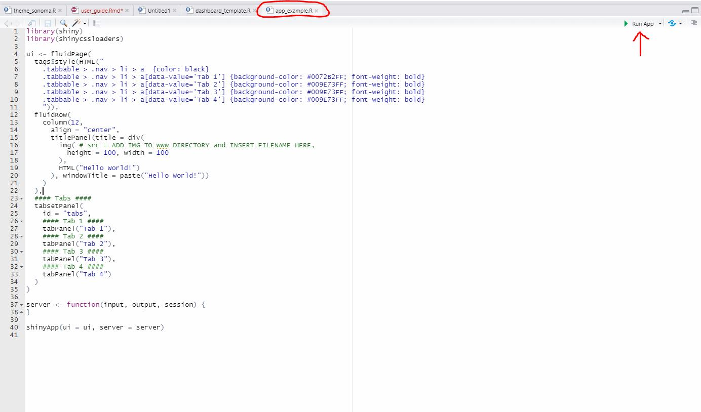

When run, the following UI is rendered:

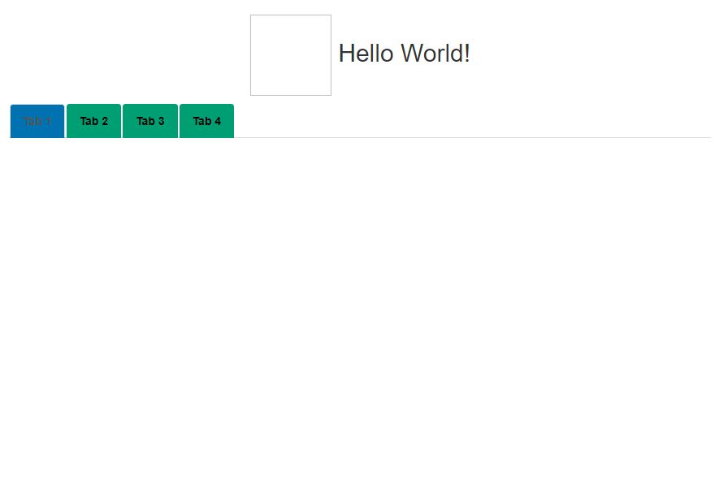

<br>

**Example 2**

- App with 5 tabs, the first three colored 1st color in palette (blue), and the other two colored 2nd color in palette (green)
- Adding an image to header **must be stored in `www` folder in same directory as app**

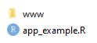


```
sonomaDashboardUI::dashboard_template(filename = 'app_example.R', 
                                      tab_num = 5,
                                      tab_names = c('Tab 1', 'Tab 2', 
                                                    'Tab 3', 'Tab 4'),
                                      tab_groups = c(3,2),
                                      app_title = "Hello World!",
                                      header_img = 'cloud.jpg',
                                      readme_file = "README_NCORE.pdf")
```

Yields:

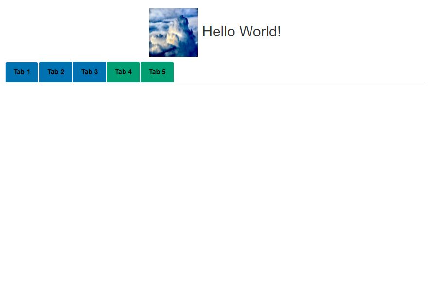


<br><br><br><br>


# boxplot

The combination of `boxplotUI()` in the ui function, and `boxplotServer()` in the server function of an app will plot
a traditional boxplot within app. 

Upper box boundary is 75th percentile, lower boundary is 25th percentile.
Whiskers extend to +/- 1.5*IQR beyond the upper/lower box boundaries in either
direction.

Data should be reactive, and include an discrete x column (plotted on x-axis) 
used to group data
in the y column, which is used to calculate box and whisker extent (i.e. the 
dataframe should have multiple observations per x-value).

If there are multiple `fill` values for a given `x` value, two 1/2 width boxes will be
plotted, offset horizontally according to the `position_dodge` argument. 

Optional features include an hline, and labels with an aggregate value per box.

If specified, the plot's coordinates may be
flipped (e.g. `x` and `x_lab` will appear on the y-axis, and boxes will be
horizontally oriented.)

An optional argument in the server function, `plot_specs`, allows a user to add any additional ggplot elements
to the plot (e.g. an additional hline, annotation, theme element, etc).

The UI function renders the plot in a column of width 10, **offset by 1**, within a fluidRow.

### Docstring parameters

**Note: data must be a reactive value, and wrapped in shiny::reactive() in the function call to boxplotServer()**

BoxplotUI():

```
#' @param id string ID label that links boxplotUI() to boxplotServer()
```

BoxplotServer():

```
#' @param id string ID label that links boxplotUI() to boxplotServer()
#' @param data reactive Reactive dataframe
#' @param x string Column name of data categories to place on x-axis
#' @param y string Column name of values used to calculate boxes per x value
#' @param agg_ann string (optional) Column name with values to aggregate and
#'                                  use as labels per each x value
#' @param agg_fun FUN (optional) Function used to aggregate agg_ann when
#'                               calculating labels per box (e.g. sum, min, max)
#' @param fill string (optional) Column name of fill value of each box
#' @param ann string (optional, default = NULL) Column name of text annotation
#'                   for each box
#' @param x_lab string (optional) X-axis label
#' @param y_lab string (optional) Y-axis label
#' @param fill_lab string (optional) Legend label of fill category
#' @param title string (optional) Title of plot
#' @param hline_int int (optional) X intercept of hline if one is desired. If
#'                       not specified, no hline will be drawn.
#' @param hline_ann string (optional) Label for hline
#' @param coord_flip (optional) If TRUE (defualt), coordinates are flipped
#'                              (boxes are oriented horizontally).
#' @param position_dodge numeric (optional) The offset between boxes plotted for
#'                                          the same x-value. Default is 0.5.
#' @param position_dodge_ann numeric (optional) The offset between labels
#'                                   plotted for the same x-value. Default=0.75.
#' @param ann_vjust numeric (optional) The vertical adjustment of optional box
#'                          labels. Default is 1.
#' @param plot_specs (optional) obj Additional GGplot elements to add to plot
#'                          e.g. theme(axis.text.x = element_text(angle = 90)).
#'                          If multiple elements are to be added, must be
#'                          a vector (e.g. c(ylim(0,4),
#'                          hline(y_intercept = 0, color = 'red))).
```

### Examples

All examples use NCore data loaded from the .RData file (See "Access Example Data" section).

**Note: data must be a reactive value, and wrapped in shiny::reactive() in the function call to boxplotServer()**

<br>

**Example 1**

- Boxplot of median values for a subset of 4 sites
  - boxplotUI() called in ui object
  - boxplotServer() called in server function
- Boxes are colored by sample duration value (fill)
- The sum of countValid across all observations per site is displayed above each box
- A y-axis label is specified
- A horizontal line is plotted at a y-value of 1
- An additional ggplot element is added, setting the upper y-axis limit to 3

```
ui <- fluidPage(
    boxplotUI(id = 'BP')
)

server <- function(input, output, session) {
  boxplotServer('BP',
                data=reactive({OC_Step2 %>%
                    filter(AQS_SITECODE %in% c('010730023',
                                               '020900034',
                                               '040139997',
                                               '040191028'))}),
                x='AQS_SITECODE',
                y='median',
                fill='sample_duration',
                agg_ann = 'countValid',
                agg_fun = sum,
                x_lab=NULL,
                y_lab='Slope change (% per year)',
                title='Median Values per Site',
                hline_int = 1,
                coord_flip=FALSE,
                plot_specs = ylim(NA, 3))
}
```

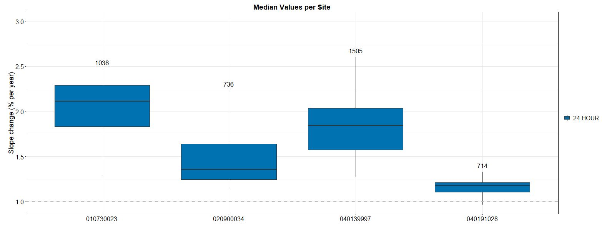

**Example 2**

- Boxplot of median values for a subset of 4 sites
  - boxplotUI() called in ui object
  - boxplotServer() called in server function
- Boxes are colored by sample duration value (fill)
- A x- and y-axis labels are specified
- Coordinates are flipped

```
ui <- fluidPage(
    boxplotUI(id = 'BP')
)

server <- function(input, output, session) {
  boxplotServer('BP',
                data=reactive({OC_Step2 %>%
                    filter(AQS_SITECODE %in% c('010730023',
                                               '020900034',
                                               '040139997',
                                               '040191028'))}),
                x='AQS_SITECODE',
                y='median',
                fill='sample_duration',
                x_lab='AQS Sitecode',
                y_lab='Slope change (% per year)',
                title='Median Values per Site',
                coord_flip=TRUE)
}
```

Note that when coord_flip = TRUE, all "y" specifications (e.g. y_lab) are
plotted on the x-axis and vice versa.


<br><br><br><br>


# boxplotMod

The combination of `boxplotModUI()` in the ui function, and `boxplotModServer()` in the server function of an app will plot
a modified boxplot within app. 

In this modified boxplot, the upper and lower extents of each box and accompanying whiskers are passed explicitly as columns (whereas in a "traditional" boxplot, these are calculated per x-value internally).

The data for boxplotModServer should have a single row per x-value, with 6 columns to specify the:

- x (discrete x values)
- ymin (lower whisker extent)
- ymax (upper whisker extent)
- lower (lower box boundary)
- upper (upper box boundary)
- median (median value)

The lower and ymin/upper and ymax values may be set to the same column name if no whiskers are desired.

For example, the `lm_sorted` dataframe in the example data (See Access Example Data section) has just
4 columns... ymin = lower = `pct10`, and ymax = upper = `pct90`:

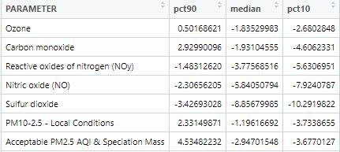

Either the x value must not have duplicates, or the x + optional x_group must not have duplicates.

Optional additions include an annotation above each box, an hline, and flipped coordinates.

The UI function renders the plot in a column of width 10, **offset by 1**, within a fluidRow.


### Docstring Parameters:

**Note: data must be a reactive value, and wrapped in shiny::reactive() in the function call to boxplotModServer()**

boxplotModUI():

```
#' @param id string ID label that links boxplotModUI() to boxplotModServer()
```

boxplotModServer():

```
#' @param id string ID label that links boxplotUI() to boxplotServer()
#' @param data reactive Reactive dataframe
#' @param x string Column name of data to place on x-axis
#' @param lower string Column name of lower border value of each box
#' @param upper string Column name of upper border value of each box
#' @param ymin string Column name of lower whisker extent for each box
#' @param ymax string Column name of upper whisker extent for each box
#' @param median string Column name of median value of each box
#' @param x_group string (optional) Column name of column to concatenate
#'                                  with x-column to make each x value
#'                                  unique (e.g. duration)
#' @param fill string (optional) Column name of fill value of each box
#' @param ann string (optional, default = NULL) Column name of text annotation
#'                   for each box
#' @param x_lab string (optional) X-axis label
#' @param y_lab string (optional) Y-axis label
#' @param fill_lab string (optional) Legend label of fill category
#' @param title string (optional) Title of plot
#' @param hline_int int (optional) X intercept of hline if one is desired. If
#'                       not specified, no hline will be drawn.
#' @param coord_flip (optional) If TRUE (defualt), coordinates are flipped 
                     (boxes are oriented horizontally).
```

### Examples

All examples use NCore data loaded from the .RData file (See "Access Example Data" section).

**Note: data must be a reactive value, and wrapped in shiny::reactive() in the function call to boxplotModServer()**

<br>

**Example 1**

- Modified boxplot as seen on NCore Dashboard. By setting lower=ymin and upper=ymax, no whiskers are plotted.
- Coordinates are flipped
- X values are not distinct, so x_group is specified to create unique values to plot on the x-axis (parameter; sample duration)

```
ui <- fluidPage(
  boxplotModUI('TrendsSummary')
)

server <- function(input, output, session) {
  boxplotModServer('TrendsSummary',
              data=reactive({lm_sorted}),
              x='PARAMETER',
              ymin='pct10',
              lower='pct10',
              ymax='pct90',
              upper='pct90',
              median='median',
              x_group = 'SAMPLE_DURATION',
              fill='Significant',
              ann = 'countTrends',
              x_lab=NULL,
              y_lab='Slope change (% per year)',
              title="Range (10th, median, and 90th percentile) of slope trends 
                                      \nat NCore sites with 7+ years of data",
              hline_int = 0,
              coord_flip=TRUE)
}
```

Yields:

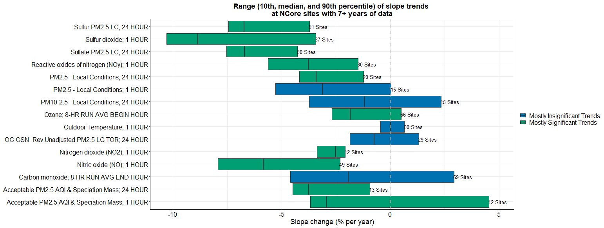


<br><br><br><br>


# detectionLimitsPlot

The set of detectionLimitsPlot functions create a "zoomable", modified
scatterplot where text labels are plotted on an x-y axis, and these labels are colored and sized by
specified values.

The data should have a column with labels to be plotted, columns for x and y arguments that determine a 
label's position on the plot, and columns that determine the color and size of
each label.

A user may optionally pass a reactive value and column name to filter the
dataframe before it is plotted (e.g. A value from a selectInput to filter
data by year (filter_col = 'YEAR')).

The UI function includes a brush and double-click reaction, which is called in the server function to
update the plotted x and y limits (zoom). The zoom may be reset by double-clicking
the plot again.

The UI function renders the plot in a column of width 10, **offset by 1**, within a fluidRow.

The server function **returns a character vector of the plotted labels** which
updates when the plot is zoomed. This is useful because it may be passed
to, for example, a table to filter the table to only what's shown in the plot
(current NCore setup).

### Docstring Parameters

**Note: The following arguments must be reactive values, and wrapped in shiny::reactive() in the function call to detectionLimitsPlotServer()**

- input_data
- filter_rct

detectionLimitsPlotUI():

```
#' @param id string ID label that links detectionLimitsPlotUI() to detectionLimitsPlotServer()
```


detectionLimitsPlotServer():

```
#' @param id string ID label that links detectionLimitsPlotUI() to 
#'                  detectionLimitsPlotServer()
#' @param input_data reactive Reactive dataframe with columns that determine x
#'                            and y position, label, size, and color.
#' @param x string Column name of x-position
#' @param y string Column name of y-position
#' @param color string Column name that determines color of plotted label
#' @param label string Column name with labels to be plotted
#' @param size numeric Column name that determines size of plotted label 
#' @param x_lab string (optional) X-axis label, 
#'                     default = 'Percent above detection limit (%)'
#' @param y_lab string (optional) Y-axis label, 
#'                     default = 'Detection limit (median in units of measure)'
#' @param color_lab string (optional) Title for color category in legend
#' @param size_lab string (optional) Title for size category in legend
#' @param title string (optional) Plot title
#' @param filter_col string (optional) Column used to filter data based on
#'                          specified `filter_rct`.
#' @param filter_rct reactive Value in `filter_col` to filter dataframe on
```

### Return value

detectionLimitsPlotServer() returns a character string with all labels currently
displayed on the plot. This list updates as a user zooms the plot to view to a subset of labels.

**Call to detectionLimitsPlotServer() must be stored as variable to access return value** (see Example 1 below).

Use case:

The NCore dashboard features a detection limits plot, with a table below that
shows details of each plotted method. When a user zooms to a subset of the
plot, the server function returns an updated list of displayed method codes (a subset)
that may then be passed to the table function to filter the shown methods
to only those shown on the plot.

### Examples

All examples use NCore data loaded from the .RData file (See "Access Example Data" section).

**Note: The following arguments must be reactive values, and wrapped in shiny::reactive() in the function call to detectionLimitsPlotServer()**

- input_data
- filter_rct

<br>

**Example 1**

- Detection limits plot displayed on the NCore Dashboard.
- Return value from plot (character vector of displayed labels) is stored in variable called zoomed_methods. This will update any time the zoom of the plot changes (including on reset -- all method codes shown).
- UI includes a drop-down menu for Parameter Group (id = 'DLParamType'), whose value is passed to filter arguments in call to server function
- Method codes are plotted according to % above detection limit ('pct_GTDL') and completeness ('median'), colored by parameter type ('parameter'), and sized according to count of measurements ('count')
- size_lab specified to customize tite in legend
- Default x- and y-axis labels used (neither are specified)

```
ui <- fluidPage(
   fluidRow(column(6, offset=1,
                 div(selectInput('DLParamType',
                     label = 'Select Parameter Group',
                     choices = as.vector(unique(GTDL_4_app$group1)),
                     selected = 'Required Gases'), style = 'padding-top:20px;')
                   )
            ),
             detectionLimitsPlotUI('DetectionLimitPlot'),
             tableUI('DetectionLimitTable')
)

server <- function(input, output, session) {
  zoomed_methods <- detectionLimitsPlotServer(id='DetectionLimitPlot',
                                              input_data=reactive({GTDL_4_app}),
                                              x='pct_GTDL',
                                              y='median',
                                              label='method_code',
                                              color='parameter',
                                              size='count',
                                              color_lab=NULL,
                                              size_lab='Count of Measurements',
                                              filter_col = 'group1',
                                              filter_rct=shiny::reactive({
                                                            input$DLParamType
                                                            }))
}

```

Yields:

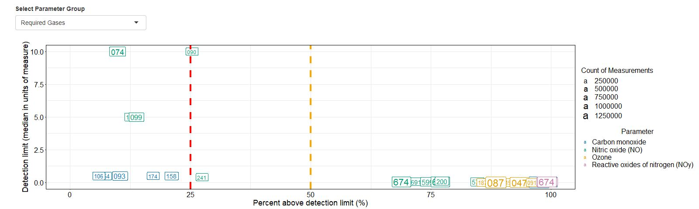


<br><br><br><br>


# lineplot

The combination of `linplotUI()` in the ui function, and `lineplotServer()` in the server function of an app will plot
a line plot within the app.

Data should have columns with x and y values, units of the y value, and color.

Optional specifications:
- linetype, passed into the aes function of ggplot (will appear in legend) 
- line width, which applies to all lines (applied outside of ggplot's aes function)
- points overlaid on lines for each observation -- size of points may be specified
- labels for each observation
- Up to 2 filters based on reactive values
- gghighlight functionality (Colors only the line/points that meet highlight_value_rct). Other line(s)/points will be colored gray. To include highlight functionality, set `highlight = TRUE` and specify `highlight_value_rct` and `highlight_col`
- An annotation in the bottom-left corner of the plot when no highlight value is selected

The UI function renders the plot in a column of width 10, **offset by 1**, within a fluidRow.

### Docstring parameters

**Note: The following arguments must be reactive values, and wrapped in shiny::reactive() in the function call to lineplotServer()**

- input_data
- filter_rct
- filter2_rct
- highlight_value_rct

lineplotUI():

```
#' @param id string ID label that links lineplotUI() to lineplotServer()
```

lineplotServer():

```
#' @param id string ID label that links lineplotUI() to lineplotServer()
#' @param input_data reactive Reactive dataframe
#' @param x string Column with values to plot on x-axis
#' @param y string Name of values to plot on y-axis
#' @param units string Name of column with units per value
#' @param color string Name of column with groups to separate data into
#'                     distinct lines (e.g. one line per sitecode)
#' @param linetype string (optional) Name of column that determines linetype. 
#'                        If null, (default) all column will be solid.
#' @param line_width numeric (optional) Width of lines
#' @param point boolean (optional) If TRUE (default), points will be plotted 
#'                       over lines
#' @param point_size numeric (optional) Size of points, if points = TRUE
#' @param label string (optional) Name of column with labels to print above 
#'                     every data point
#' @param label_size integer (optional) Size of label text, if label is 
#'                           specified. (default = 8)
#' @param label_vjust numeric (optional) Vertical adjustment of labels compared
#'                            to position of observation, if label is specified.
#'                            (default = -1.05)
#' @param title string (optional) Plot title
#' @param x_lab string (optional) X-axis label. If not specified, left blank
#' @param y_lab string (optional) Y-axis label. If not specified, defaults to 
#'                     unit value of filter_rct (if specified) or NULL
#' @param color_lab string (optional) Legend label for color categories
#' @param linetype_lab string (optional) Legend label for linetype categories
#' @param filter_rct reactive value to plot
#' @param filter_col string Column name of values to filter on
#' @param filter2_rct reactive (optional) Duration to plot. If spcified, 
#'                             input_data is filtered to the passed value.
#' @param filter2_col string (optional) Column name of durations
#' @param highlight boolean (optional) If TRUE, all lines but highlight line are
#'                                     gray. If false, colors applied as normal
#'                                     aes.
#' @param highlight_col string Column name with value to determine highlighted 
#'                             line(s)
#' @param highlight_value_rct reactive (optional) Value to highlight (equality)
#' @param x_numeric boolean (optional, default = TRUE) If TRUE, x-axis is
#'                          set as continuous and pretty_breaks() is called.
#' @param corner_ann string (optional) Annotation to put in the top-right corner
#'                           when no highlight value is specified. Default is
#'                           "Select site on map to highlight"
#' @param plot_specs (optional) obj Additional GGplot elements to add to plot
#'                    e.g. theme(axis.text.x = element_text(angle = 90)).
#'                    If multiple elements are to be added, must be
#'                    a vector (e.g. c(ylim(0,4), hline(y_intercept = 0))).
```

### Examples

All examples use NCore data loaded from the .RData file (See "Access Example Data" section).

**Note: The following arguments must be reactive values, and wrapped in shiny::reactive() in the function call to lineplotServer()**

- input_data
- filter_rct
- filter2_rct
- highlight_value_rct

<br>

**Example 1**

- Lineplot as seen in the NCore app. 
- UI shown below includes to selectInput menus with parameter and duration choices.
- Displays trends for a specified parameter and duration per site (colored by site). Parameter and Site selections set as filter and filter2 values.
- Includes gghighlight functionality linked to the site selected on the sitemap (see sitemap section). When no site is selected, all lines are gray. When a site is selected, all lines but the selected site are gray.

```
ui <- fluidPage(
    fluidRow(column(5,offset=1,
                   selectInput('TrendParam',
                               label='Choose a Parameter',
                               choices = (trend_data_4_fig_raw %>%
                                 filter(SAMPLE_DURATION == '1 HOUR') %>%
                                 pull(PARAMETER)),
                               selected='Nitric oxide (NO)')),
             column(5,
                    selectInput('TrendDuration',
                                label='Choose a Duration',
                                choices=unique(
                                            trend_data_4_fig_raw$SAMPLE_DURATION
                                            ),
                                selected='1 HOUR')))),
   lineplotUI('TrendsLine')
)

server <- functon(input, output, session) {
  lineplotServer(id='TrendsLine',
                 input_data=reactive({trend_data_4_fig_raw}),
                 x='YEAR',
                 y='ARITHMETIC_MEAN',
                 units='UNITS_OF_MEASURE',
                 title = 'Annual Mean Concentration per Site',
                 color='AQS_SITECODE',
                 filter_rct=reactive({input$TrendParam}),
                 filter2_rct=reactive({input$TrendDuration}),
                 filter_col='PARAMETER',
                 filter2_col='SAMPLE_DURATION',
                 highlight_col = 'AQS_SITECODE',
                 highlight_value_rct = reactive({selected_site$sitecode}))
}

```

Yields (with site '320030540' selected on map):

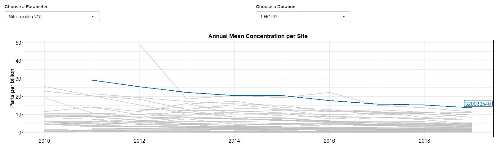

**Example 2**

- Simple lineplot with subset of data, including points and labels
- Highlight set to false -- all lines colored
- x, y, color, and linetype aesthetics added to line
- x, y, color aesthetics added to point
- Corner annotation is blank
- Point set to true, and point size specified
- Label text size and position adjusted
- Additional plot specification (upper y limit) added

```
ui <- fluidPage(
  lineplotUI('LP')
)

server <- function(input, output, session) {
  lineplotServer(id='LP',
                 input_data = reactive({trend_data_4_fig_raw %>%
                     filter(AQS_SITECODE == '320030540',
                            SAMPLE_DURATION == '1 HOUR')}),
                 x='YEAR',
                 y='ARITHMETIC_MEAN',
                 y_lab = "Arithmetic Mean",
                 title = 'The Best Lineplot',
                 color = 'PARAMETER',
                 linetype = 'PARAMETER',
                 point = TRUE,
                 point_size = 3,
                 line_width = 0.25,
                 label = 'index',
                 label_size = 5,
                 label_vjust = -1.1,
                 highlight = FALSE,
                 corner_ann = "",
                 plot_specs = ylim(NA, 80))
}
```

Yields:


<br><br><br><br>


# networkCompleteness

A specific application of a scatter plot that displayes the values all of, or a subset of measurements
for a given discrete x-value plotted atop an optional line segment representing the
x-value.

networkCompletenessUI()` should be added to the UI object, and `networkCompletenessServer` should
be added to the server function.

Includes the options for:
- A vertical line segment at each x-value, spanning from the min to max plotted measurement atop which individual points are plotted.
- A horizontal line at a specified y-intercept
- A reactive filter on input data
- A "highlight" on a reactive value, which places a label below the point/segment for the specified value.

If `segment = TRUE`, two extra columns, seg_min and seg_max, must be specified to
set the vertical extent of the segments per x-value.

This plot features modified "tooltip" functionality. The UI function includes
a brush and double-click. When a user drags a box across the plot and double-clicks,
details on the data encompassed by the box will be displayed below the
plot in a table. The data displayed in the table is configurable. **This feature may be excluded by setting add_brush = FALSE in the UI function**

The UI function renders the plot in a column of width 10, **offset by 1**, within a fluidRow.

### Docstring parameters

**Note: The following arguments must be reactive values, and wrapped in shiny::reactive() in the function call to networkCompletenessServer()**

- input_data
- title_rct
- filter_rct
- highlight_value_rct


networkCompletenessUI():

```
#' @param id string ID that links networkCompletenessUI() to 
#'                  networkCompletenessServer()
#' @param add_brush boolean If TRUE (default), brush and double-click added to
#'                          rendered plot. This allows users to display details
#'                          of selected data below the plot.
```

networkCompletenessServer():

```
#' @param id string ID that links networkCompletenessUI() to 
#'                  networkCompletenessServer()
#' @param input_data reactive Reactive data frame
#' @param x string Column name of x-axis value
#' @param segment boolean (optional) If TRUE (default), a vertical segment will
#'                        be drawn. Requires seg_min, seg_max values.
#' @param seg_min string (optional) Required if segment is TRUE.
#'                       Column name of segment minimum value
#' @param seg_max string (optional) Required if segment is TRUE.
#'                       Column name of segment maximum value
#' @param y string Column name of y-axis value of points
#' @param color string (optional) Column name of value to color points by
#' @param param_col string (optional) Column name for parameter name
#' @param param_code_col string (optional) Column name for parameter code.
#'                              Should be specified if passing a subset of
#'                              parameter codes in `param_code_list`.
#' @param param_code_list character vector (optional) List of parameter codes to
#'                                         plot.
#' @param table_cols character vector (optional) Columns to include in table
#'                                    that appears when plot is brushed. If not
#'                                    specified, all columns are included.
#' @param table_col_labels character vector (optional) Specific column labels to
#'                                          print in table. Must match in order
#'                                          with 'table_cols'. If not specified,
#'                                          column names in input_data will
#'                                          be used.
#' @param xlab string (optional) Label for x-axis. 
#'                    Default = 'Rank ordered site completeness'.
#' @param ylab string (optional) Label for y-axis. Default = 'Completeness (%)'.
#' @param title_rct reactive (optional) Plot title. Must be reactive. 
#'                           Default = reactive({NULL}).
#' @param hline_int integer (optional) Y-intercept of horizontal line. 
#'                          Default = NA.
#' @param hline_ann string (optional) Annotation for optional horizontal line. 
#'                         Default = ''.
#' @param hline_color string (optional) Color of hline (if hline int specified)
#' @param filter_col string (optional) Column name of column to filter data by. 
#'                          Default = NULL.
#' @param filter_rct reactive (optional) Value to filter data by. 
#'                            Default = reactive({NULL}).
#' @param highlight_col string (optional) Column name of column that determines 
#'                             segment to highlight. Default = NULL.
#' @param highlight_rct reactive (optional) Value to highlight. 
#'                               Default = reactive({NULL}).
#' @param corner_ann string (optional) Annotation in plot corner when no value 
#'                          is highlighted.
#' @param plot_specs (optional) obj Additional GGplot elements to add to plot
#'                    e.g. theme(axis.text.x = element_text(angle = 90)).
#'                    If multiple elements are to be added, must be
#'                    a vector (e.g. c(ylim(0,4), hline(y_intercept = 0))).
```

### Examples

All examples use NCore data loaded from the .RData file (See "Access Example Data" section).

**Note: The following arguments must be reactive values, and wrapped in shiny::reactive() in the function call to networkCompletenessServer()**

- input_data
- title_rct
- filter_rct
- highlight_value_rct

<br>

**Example 1**

- Full NCore example, as seen on dashboard
- `highlight_rct` value passed from sitemap tab (see sitemap section). Shown selection is site '49035006'.
- UI below includes year selectInputs, passed to `filter_rct`
- Subset of table columns specified to display when brush enforced, with table header labels specified.
- Title is reactive, and changes with year drop-down
- Horizontal line with label plotted at 75%
- Additional ggplot element ylim added via `plot_specs` argument

```
ui <- fluidPage(
  fluidRow(column(5, offset = 1,
                  htmltools::div(style='padding-top: 15px; padding-left:42px',
                                 selectInput('NCYearSelect',
                                 label='Select a complete year',
                                 choices=c(2017,2018,2019),
                                 selected=2019))),
             networkCompletenessUI('NetworkCompleteness'))
)

server <- function(input, ouput, server){
  networkCompletenessServer(id='NetworkCompleteness',
                            input_data = shiny::reactive({completeness_4_fig}),
                            x = 'order',
                            seg_min = 'minComplete',
                            seg_max = 'maxComplete',
                            y = 'OBSERVATION_PERCENT',
                            color = 'PARAMETER',
                            param_col = 'PARAMETER',
                            table_cols = c('order',
                                           'AQS_SITECODE',
                                           'YEAR',
                                           'PARAMETER',
                                           'METHOD',
                                           'SAMPLE_DURATION',
                                           'OBSERVATION_PERCENT',
                                           'SiteComplete'),
                            table_col_labels = c('Site Rank',
                                                 'Site Code',
                                                 'Year',
                                                 'Parameter',
                                                 'Method',
                                                 'Duration',
                                                 '% Complete (Parameter)',
                                                 '% Complete (Site)'),
                            xlab = 'Rank ordered site completeness',
                            ylab = 'Completeness (%)',
                            title = reactive({paste('Network Completeness:', 
                                              input$NCYearSelect)}),
                            hline_int = 75,
                            hline_ann = 'MQO goal of >=75%',
                            filter_col = 'YEAR',
                            filter_rct = reactive({input$NCYearSelect}),
                            corner_ann = "Select site on map to 
                                          highlight on plot",
                            highlight_col = 'AQS_SITECODE',
                            highlight_rct = reactive({selected_site$sitecode}))
}
```

Yields:

- With site '49035006' selected on the site map tab (see sitemap section)
- With brush/double-click shown as blue box to render details in table below plot

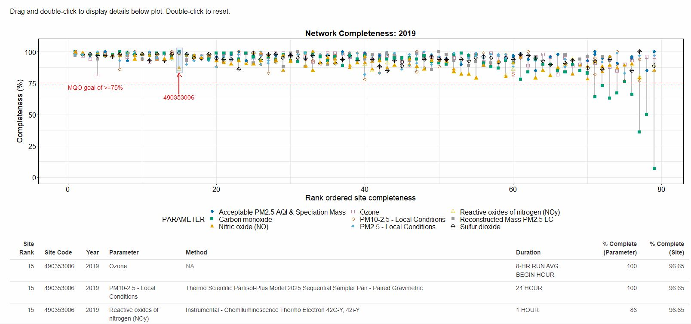


**Example 2**

- Same as above, but subset of parameters chosen by specifying `param_list` and `param_code_col`

```
ui <- fluidPage(
  networkCompletenessUI('NC')
)

server <- function(input, ouput, server){
  networkCompletenessServer(id = 'NC',
                            input_data = shiny::reactive({completeness_4_fig %>%
                                                          filter(YEAR==2019)}),
                            x = 'order',
                            segment = TRUE,
                            seg_min = 'minComplete',
                            seg_max = 'maxComplete',
                            y = 'OBSERVATION_PERCENT',
                            param_col = 'PARAMETER',
                            table_cols = c('order',
                                           'AQS_SITECODE',
                                           'YEAR',
                                           'PARAMETER',
                                           'METHOD',
                                           'SAMPLE_DURATION',
                                           'OBSERVATION_PERCENT',
                                           'SiteComplete'),
                            table_col_labels = c('Rank',
                                                 'Site Code',
                                                 'Year',
                                                 'Parameter',
                                                 'Method',
                                                 'Duration',
                                                 '% Complete (Parameter)',
                                                 '% Complete (Site)'),

                            color = 'PARAMETER',
                            param_code_list = c('44201', '88101', '42401'),
                            param_code_col = 'PARAMETER_CODE',
                            xlab = 'Rank ordered site completeness',
                            ylab = 'Completeness (%)',
                            hline_int = 75,
                            plot_specs = ylim(0,100))
}
```

Yields:

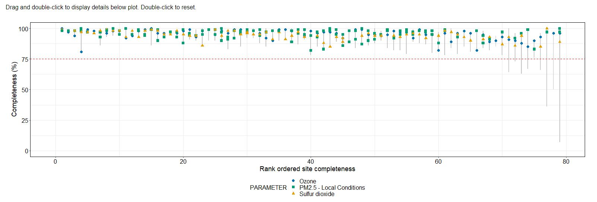

**Example 3**

- Plotted for dataset filtered to one year, on patameter (e.g. one observation per site)
- No segments plotted
- No color specified (removes legend)
- Brush functionality turned off in UI function (details table not applicable)
- No highlight specified
- Title specified (**still must be wrapped in reactive**, even if static string)

```
ui <- fluidPage(
  networkCompletenessUI('NC', add_brush = FALSE)
)

server <- function(input, ouput, server){
  networkCompletenessServer(id = 'NC',
                            input_data = shiny::reactive({completeness_4_fig %>%
                                filter(YEAR==2019,
                                       PARAMETER == 'Ozone')}),
                            x = 'order',
                            y = 'OBSERVATION_PERCENT',
                            title = reactive({'Ozone Completeness per Site'}),
                            segment = FALSE,
                            param_col = 'PARAMETER',
                            xlab = 'Rank ordered site completeness',
                            ylab = 'Completeness (%)',
                            hline_int = 75,
                            plot_specs = ylim(0,100))

}
```

Yields:

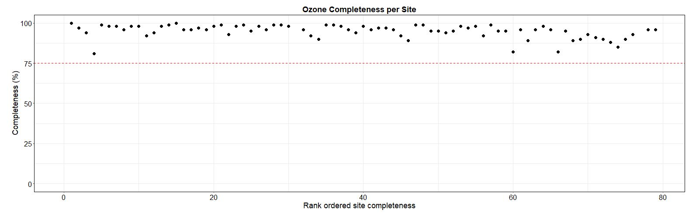


<br><br><br><br>


# pollutionRose

Adds a pollution rose of 1hr concentration data to an app.

`pollutionRoseUI()` should be added to the UI object, and `pollutionRoseServer` should
be added to the server function.

Takes in two different dataframes, one with 1hr concentration data and
one with wind data. 

Input concentration data should be in "long-form" with a column for parameter, 
concentration, unit, site, and a "key" (typically a timestamp) used to spread the data by parameter. 

Wind data should have wind direction and wind speed columns, as well as the **same key_col and site_col** 
as the 1-hr concentration data. These are used to join
the wind data to the concentration data.

Accepts an existing brush to adjust plot boundaries based on selection from another plot. 
Brush object should be a list with \$xmin/\$xmax and \$ymin/$ymax values. This functionality
is used in the timeseriesInvestigationTab wrapper function (see timeseriesInvestigationTab section)
to link the plot limits of a timeseries plot to the pollution rose.

**UI function does not include any layout elements** (i.e. plotOutput is not wrapped in a fluidRow or column)

### Docstring parameters

**Note: The following arguments must be reactive values, and wrapped in shiny::reactive() in the function call to pollutionRoseServer()**

- data_1hr_rct
- data_wind_rct
- param_rct

pollutionRoseUI():

```
#' @param id string ID used to link pollutionRoseTabUI() to pollutionRoseTabServer()
```

pollutionRoseServer():

```
#' @param id string ID used to link pollutionRoseUI() to pollutionRoseServer()
#' @param data_rct reactive Parameter concentration data. Should have
#'                              columns for site, parameter, unit
#'                              and "key" used in joining wind to concentration 
#'                              data (typically a timestamp)
#' @param data_wind_rct reactive Wind data. Should have column for
#'                               direction and speed, and the same 
#'                               key_col and site_col as data_1hr_rct. Speed can
#'                               be filled with NA if unavailable.
#' @param wd_col string Name of column in wind data with direction values.
#' @param ws_col string Name of column in wind data with speed values.
#' @param param_col string Name of column in 1-hr concentration data with
#'                         parameter name values.
#' @param param_rct reactive string Parameter to plot on windrose. Used to
#'                                  filter 1-hr concentration data via the
#'                                  param_col.
#' @param measurement_col string Name of column in 1-hr concentration data with
#'                         parameter name values.
#' @param key_col string Name of column in 1-hr concentration and wind data with
#'                         key values (typically datetime column).
#' @param unit_col string Name of column in 1-hr concentration data with
#'                         unit values.
#' @param site_col string Name of column in 1-hr concentration data with
#'                         sitecode values.
#' @param brush (optional) reactive Brush object with elements for x and y that
#'                         are each vectors with x/y min and x/y max values
#'                         respectively (e.g. list(x=c(0,10), y=c(-10,10)))
#' @param title (optional) string Title for plot. If not specified, title will 
#'                         be current value of param_rct.
```


### Examples

All examples use NCore data loaded from the .RData file (See "Access Example Data" section).

**Note: The following arguments must be reactive values, and wrapped in shiny::reactive() in the function call to pollutionRoseServer()**

- data_rct
- data_wind_rct
- param_rct

<br>

**Example 1**

- Plots one site's worth of 1hr data
- Parameter plotted is 'Ozone'. Must be wrapped in reactive() even if a static string is passed.
- `key_col` ('date_time2') and `site_col` ('AQS_SITECODE') exist in both `TS_1hr_data` and `WD_step1`
- Title is not specified, so will be the value of param_rct
- No brush passed

```
ui <- fluidPage(
  fluidRow(column(5, offset = 1,
      pollutionRoseUI('PR)))
)

server <- function(input, output, session) {
  pollutionRoseServer(
    id='PR',
    data_rct = reactive({TS_1hr_data %>%
        filter(AQS_SITECODE == '320030540')}),
    data_wind_rct = reactive({WD_step1}),
    wd_col = 'WD',
    ws_col = 'WS',
    param_col = 'parameter',
    measurement_col = 'sample_measurement',
    key_col = 'date_time2',
    unit_col = 'units_of_measure',
    site_col = 'AQS_SITECODE',
    param_rct = reactive({'Ozone'}),
    title = NULL
  )
}
```

Yields:

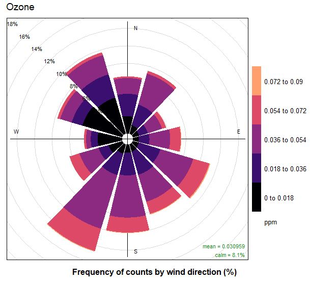


<br><br><br><br>


# scatter

The combination of `scatterUI()` in the UI object and `scatterServer()` in the
server function will add a scatterplot to an app.

Takes in a two dataframes, each with data for one of 2 parameters to plot
on the x and y axis. DFs need columns for parameter name, unit of measurement, 
and
measurement values. Joins the dataframe so that values in the 
parameter column become their own columns named for each parameter
using `key_col` as the join key (typically a timestamp).

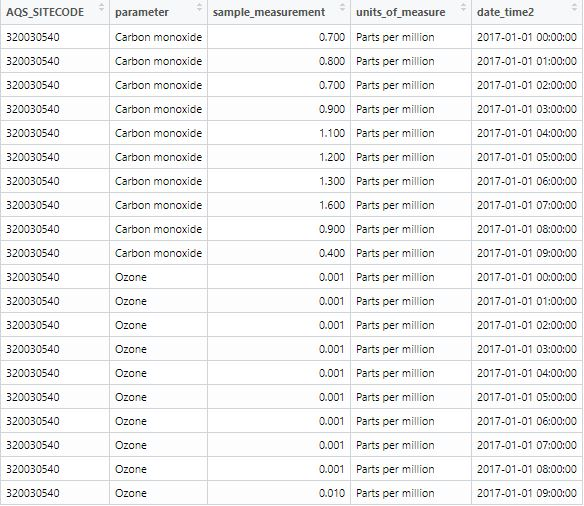

Accepts an existing brush to filter key_col based on x-axis selection from another plot. 
Brush object should be a list with \$xmin/\$xmax values. This functionality
is used in the timeseriesInvestigationTab wrapper function (see timeseriesInvestigationTab section)
to link the plot limits of a timeseries plot to the scatterplot.

Optionally plots a 1-to-1 a-b line and/or a linear regression line (Integration of 
check-boxes to toggle these lines can be configured in the UI function).

The UI function wraps the plot in a column of width 9, and the checkboxes with
the checkboxes to toggle reference lines in a column of width 3. There is no
offset included. The call to scatterUI() may be wrapped in a column to add
an offset, and adjust plot width.


### Docstring parameters

**Note: The following arguments must be reactive values, and wrapped in shiny::reactive() in the function call to scatterServer()**

- data_param1_rct
- data_param2_rct
- param_rct
- sec_param_rct

scatterUI():

```
#' @param id string ID that links scatterUI() to scatterServer()
#' @param add_regression_option bool (optional) If TRUE (default), 
#'                                   adds checkbox to add linear regression line
#'                                   to scatterplot.
#' @param add_one2one_option bool (optional) If TRUE (default), 
#'                                   adds checkbox to add one-to-one line
#'                                   to scatterplot.
```

scatterServer():

```
#' @param id string ID that links scatterUI() to scatterServer()
#' @param data_param1_rct reactive Reactive df with columns for parameter,
#'                              measurement and unit with a key used to join
#'                              data1 to data2. Should only contain data for
#'                              param_1_rct.
#'                              spreading the dataframe by parameter.
#' @param data_param2_rct reactive Reactive df with columns for parameter,
#'                              measurement and unit with a key used to join
#'                              data1 to data2. Should only contain data for
#'                              param_2_rct.
#' @param param_col string Column name of column with parameter values
#' @param poc_col string Column name of column iwth poc number
#' @param measurement_col string Column name of column with measurement values
#' @param key_col string Column name of column with key values used in spread
#'                       operation, and column affected by
#'                       brush (e.g. datetime).
#' @param unit_col string Column name of column with unit values
#' @param param_rct reactive Parameter value to plot on x-axis
#' @param sec_param_rct reactive Parameter value to plot on y-axis
#' @param brush reactive (optional) Brush object used to adjust displayed data.
#'                                  Must have elements named xmin, xmax,
#'                                  ymin, ymax.
#' @param legend_pos numeric vector (optional) Default = c(1,0), offset from
#'                                  upper-left corner that legend should be
#'                                  positioned in.
```

### Examples

All examples use NCore data loaded from the .RData file (See "Access Example Data" section).

**Note: The following arguments must be reactive values, and wrapped in shiny::reactive() in the function call to scatterServer()**

- data_param1_rct
- data_param2_rct
- param_rct
- sec_param_rct

<br>

**Example 1**

- UI wrapped in column of width 5, with offset of 1
- Both reference line options shown
- No brush passed

```
ui <- fluidPage(
  fluidRow(column(5, offset = 1,
            scatterUI('Sc')
            )
          )
)

server <- function(input, output, session) {
  scatterServer(id = 'Sc',
                data_param1_rct = reactive({TS_1hr_data %>%
                             filter(AQS_SITECODE == '320030540',
                             parameter_code == '44201')}),
                data_param2_rct = reactive({TS_1hr_data %>%
                             filter(AQS_SITECODE == '320030540',
                             parameter_code == '42101')}),
                param_col = 'parameter',
                measurement_col = 'sample_measurement',
                key_col = 'date_time2',
                unit_col = 'units_of_measure',
                poc_col = 'poc',
                param_rct = reactive({'Ozone'}),
                sec_param_rct = reactive({'Carbon monoxide'}))
}

```

Yields:


**Example 2**

- UI not wrapped in column
- Only linear regression reference line option shown (add_one2one_option in UI function)

```
ui <- fluidPage(
            scatterUI('Sc',
            add_one2one_option = FALSE)
)

server <- function(input, output, session) {
  scatterServer(id = 'Sc',
                data_param1_rct = reactive({TS_1hr_data %>%
                             filter(AQS_SITECODE == '320030540',
                             parameter_code == '44201')}),
                data_param2_rct = reactive({TS_1hr_data %>%
                             filter(AQS_SITECODE == '320030540',
                             parameter_code == '42101')}),
                param_col = 'parameter',
                measurement_col = 'sample_measurement',
                key_col = 'date_time2',
                unit_col = 'units_of_measure',
                poc_col = 'poc',
                param_rct = reactive({'Ozone'}),
                sec_param_rct = reactive({'Carbon monoxide'}))
}

```

Yields:

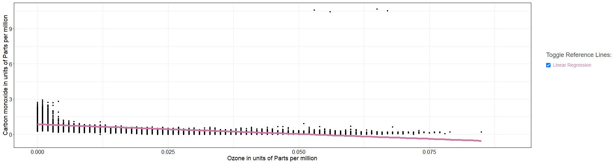

**Example 3**

- UI not wrapped in column
- Neither reference line options shown (add_one2one_option adn add_regression_option in UI function)

```
ui <- fluidPage(
            scatterUI('Sc',
            add_one2one_option = FALSE,
            add_regression_option = FALSE)
)

server <- function(input, output, session) {
  scatterServer(id = 'Sc',
                data_param1_rct = reactive({TS_1hr_data %>%
                             filter(AQS_SITECODE == '320030540',
                             parameter_code == '44201')}),
                data_param2_rct = reactive({TS_1hr_data %>%
                             filter(AQS_SITECODE == '320030540',
                             parameter_code == '42101')}),
                param_col = 'parameter',
                measurement_col = 'sample_measurement',
                key_col = 'date_time2',
                unit_col = 'units_of_measure',
                poc_col = 'poc',
                param_rct = reactive({'Ozone'}),
                sec_param_rct = reactive({'Carbon monoxide'}))
}

```

Yields:

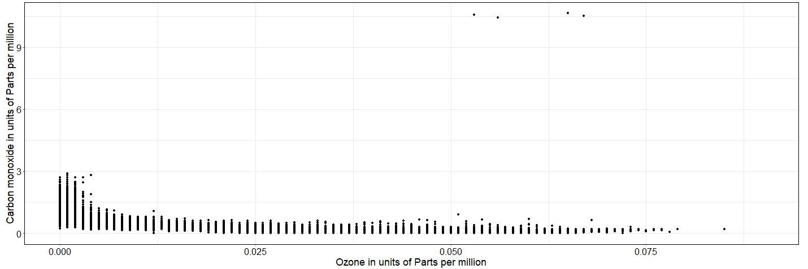

<br><br><br><br>

# sitemap

The combination of `sitemapUI()` in the UI object and `sitemapServer()` in the
server function of an app creates a leaflet plot with observations plotted
as circles.

Optional features:

- A radio-button filter of points displayed on the map, configured by the `filter_col` argument in the UI and server function, and the `filter_labels` argument in the UI function.
- Circles colored by a specified column, configured with the `color_col` argument in the server function.
- Map caption above the plotting area

The data must have columns names 'lat' and 'lng' with latitude and longitude coordinates.

Leaflet maps record the latitude/longitude location of a user's click. This value 
is used to determine which, if any, label value was clicked. The clicked label
value is returned by the server function.

The UI function renders the plot in a column of width 10, **offset by 1**, within a fluidRow.

### Docstring parameters

**Note: data must be a reactive value, and wrapped in shiny::reactive() in the function call to sitemapServer()**

sitemapUI():

```
#' @param id string ID label that links sitemapUI() to sitemapServer()
#' @param filter_col string (optional, default = NULL) Column to filter sites
#'                          shown on map by. Should only have 2 values. If 
#'                          specified, fluidRow with radiobuttons labeled by 
#'                          `filter_labels` will be added above map. If 
#'                          specified, `filter_labels` must also be specified.
#' @param filter_labels character vector (optional, default = NULL) Must be
#'                                specified if `filter_col` is filled. Labels 
#'                                applied to radio buttons that specify sites to
#'                                be displayed on map. Initial value is 1st 
#'                                label in vector. Should be length 2.
#' @param top_message string Text to display above map. Default message is
#'                           "Click a circle on the map to select a site". If no
#'                           message desired, input an empty string.
```

sitemapServer():

```
#' @param id string ID label that links sitemapUI() to sitemapServer()
#' @param data reactive data.frame Reactive data with location info to be 
#'                      plotted on map. Must
#'                      contain columns lat, lng, and AQS_SITECODE corresponding
#'                      to lattude, longitude, and aqs site code respectively.
#' @param label_col string Column with labels for each circle.
#' @param filter_col string (optional, default = NULL) Column to filter sites
#'                          shown on map by. Should only have 2 values. If 
#'                          specified, fluidRow with radiobuttons labeled by 
#'                          `filter_labels` will be added above map. If 
#'                          specified, `filter_labels` must also be specified.
#' @param color_col string (optional, default = NULL) Column used to color site
#'                          markers on map.
#' @param color_order character vector (optional) A vector with the order of
#'                                     color values that appear in the legend.
#'                                     All values in color_col must be specified.
#'                                     1st specified will be blue, then green,
#'                                     the yellow, etc (according to sonoma_
#'                                     color_palette).
#' @param click_buffer numeric (optional) Buffer around a click to select the
#'                             closest map marker. Default = 0.003 degrees.
```

### Returns

sitemapServer returns a list with two elements, \$sitecode and $radio.

- $sitecode: If a user clicks a plotted circle on the map, the label value of the circle is returned as a string
- $radio: If a user specifies a filter, the value of the filter value (chosen radio button) is returned (if no filter specified, this remains `NULL`)
- $sitedata: If a user clicks a plotted circle on the map, the row of the input dataframe related to the circle is returned.

Use case:

In the NCore dashboard, the user can select a site on the map. The sites are 
labeled by AQS sitecode. This sitecode is then passed to other functions as
a filter value -- to only display data for the chosen site. E.g. the table
on the landing page (see table section).

**Call to sitemapServer() must be stored as variable to access return value** (see Example 1 below).

e.g. 

```
# Store call to sitemapServer
map <- sitemapServer(...)

# Access values stored in returned list
map$radio
map$sitecode
map$sitedata
```

### Examples

All examples use NCore data loaded from the .RData file (See "Access Example Data" section).

**Note: data must be a reactive value, and wrapped in shiny::reactive() in the function call to sitemapServer()**

<br>

**Example 1**

- NCore site map
- Circles colored by site setting (urban or rural)
- Filter included that plots either valid or invalid sites (radio buttons labeled in UI function, `filter_col` specified in both UI and Server functions)
- Return list stored in variable called map_obj

```
ui <- fluidPage(
  sitemapUI(id='LandingPageMap',
                         filter_col = 'Active',
                         filter_labels = c('Active Sites', 'Inactive Sites'))
)

  map_obj <- sitemapServer('LandingPageMap',
                           data = reactive({NCore_simple}),
                           filter_col = 'Active',
                           color_col = 'location_color',
                           color_order = c('Urban or Suburban', 'Rural', 
                                           'Inactive'),
                           label_col = 'AQS_SITECODE',
                           cb = reactive({input$color_pal}))
}
```

Yields:

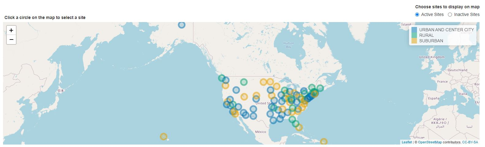

**Example 2**

- No color specified (all circles same color -- no legend)
- No filter included (`filter_col` in UI and Server function left blank)
- `top_message` passed as empty string
- Return list stored in variable called map_obj

```
ui <- fluidPage(
  sitemapUI(id='LandingPageMap',
            top_message = '')
)

server <- function(input, output, session) {
    map_obj <- sitemapServer(id ='LandingPageMap',
                             data = reactive({NCore_simple}),
                             label_col = 'AQS_SITECODE',
                             )
}
```

Yields:

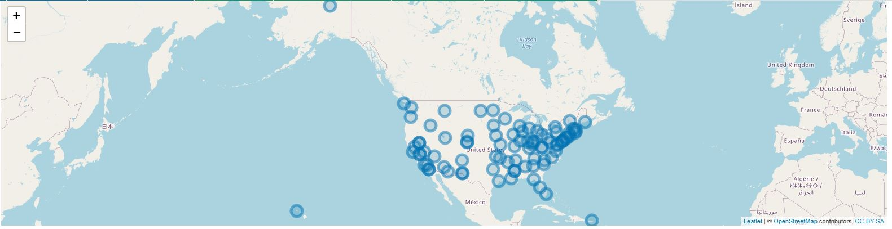

<br><br><br><br>


# table

The combination of `tableUI()` in the UI object and `tableServer()` in the
server function of an app creates a data table. The data table will have a 
search feature, and can be re-sorted by any column when a user presses the arrow
button in the column header. The table will be paginated if more rows that
`page_length` exist (default for `page_length` is 5).

A user can pass a subset of columns to `select_cols` to display, or if left blank,
all columns will be displayed.

The `col_labels` argument lets a user specify the table header names for each
column. If left blank, column names will be displayed as-is.

Optional features:

- Reactive filtering (`filter_col` and `filter_rct`)
- Rows colored by parameter (`color_col`)
- Custom arrangement (`arrange_col`)
- Reactive caption (above table)

A user may input multiple filter columns and values, but to accomodate this,
the `filter_rct` argument must be a **reactive LIST** (e.g. reactive({list(...)})).
Each filter value may be a single value, or a vector of values. If a vector, the vector
itself must be wrapped in the list call (e.g. for filter_col = YEAR,
filter_rct could be reactive({list(2019)}) or reactive({list(c(2017, 2018, 2019))})).

The UI function wraps the table in a full-width column (width = 12). The function
may be called within a smaller column to adjust the display-width of the table.

### Docstring parameters

**Note: The following arguments must be reactive values, and wrapped in shiny::reactive() in the function call to tableServer()**

- input_data
- filter_rct
- caption_rct

tableUI():

```
#' @param id string ID label that links tablueUI() to tableServer()
```

tableServer():

```
#' @param id string ID label that links tablueUI() to tableServer()
#' @param input_data reactive Reactive dataframe
#' @param page_length integer (optional, default = 5) Number of items to display
#'                            at once in table (if < nrow(input_data), table
#'                            is paginated)
#' @param select_cols character (optional, default = NULL) Vector of columns
#'                              to including in data table.
#' @param col_label_names character (optional, default = NULL) Vector of column
#'                                  header names to appear in data frame.
#'                                  Must match number of columns in input_data
#'                                  or `select_cols`` (if specified).
#' @param arrange_col string (optional, default = 1st column) Column to arrange
#'                           table by.
#' @param filter_col string (optional, default = NULL) Name of column to apply
#'                          reactive filter to...reactive filter value passed
#'                          in `filter_rct`. If specified, filter_rct must
#'                          be supplied. If not specified, table has no
#'                          reactive filtering.
#' @param filter_rct reactive list (optional, default = NULL) Reactive list of 
#'                                 values
#'                                to filter `filter_col` by. If specified,
#'                                filter_col must be supplied.If not specified,
#'                                table has no reactive filtering.
#' @param color_col string (optional, default = NULL) Column that determines row
#'                         colors. If not specified, columns will be alternating
#'                         grays.
#' @param color_order character vector (optional) A vector with the order of
#'                                    color values that appear in the legend.
#'                                    All values in color_col must be specified.
#'                                    1st specified will be blue, then green,
#'                                    the yellow, etc (according to sonoma_
#'                                    color_palette).
#' @param caption_rct reactive string (optional) default = NULL Caption for data 
#'                                     table.
#' @param pdf_button boolean (optional, default = TRUE) If true, "download
#'                            table" button added.
#' @param cb reactive (optional) If not NULL, colorblind palette will be applied
#' @param load_all_data boolean (optional) If TRUE (default), all data in table
#'                      will be loaded and available for download. If false,
#'                      only first page (visible) data is loaded and available
#'                      for download. Not recommended for large datasets.
#' @param download_filename string (optional) Defaults to 'data', the filename
#'                                 desired for downloaded table data.
```

### Examples

All examples use NCore data loaded from the .RData file (See "Access Example Data" section).

**Note: The following arguments must be reactive values, and wrapped in shiny::reactive() in the function call to tableServer()**

- input_data
- filter_rct
- caption_rct

<br>

**Example 1**

- NCore landing page table
- Rows colored by site setting
- **Filtered by site selected on map** (see sitemap section)
- No caption included

```
ui <- fluidPage(
    sitemapUI('LandingPageMap'),
    tableUI('LandingPageTable')
)
server <- function(input, output, session) {
    map_obj <- sitemapServer(id ='LandingPageMap',
                             data = reactive({NCore_simple}),
                             filter_col = 'Active',
                             color_col = 'location_setting',
                             label_col = 'AQS_SITECODE')
  tableServer('LandingPageTable',
              input_data = reactive({NCore_simple_plot}),
              select_cols = c('AQS_SITECODE', 'local_site_name', 'pqao',
                              'city', 'state', 'lat', 'lng', 'location_color'),
              col_label_names = c('AQS Site Code', 'Site Name', 'PQAO', 'City',
                                  'State', 'Latitude', 'Longitude', 'Setting'),
              arrange_col = 'AQS_SITECODE',
              filter_col = c('AQS_SITECODE', 'Active'),
              filter_rct = reactive({list(selected_site$sitecode, 
                                          map_obj$radio)}),
              color_col = 'location_color',
              color_order = c('Urban or Suburban','Rural','Inactive'),
              cb = reactive({input$color_pal}))
}
```

Yields:

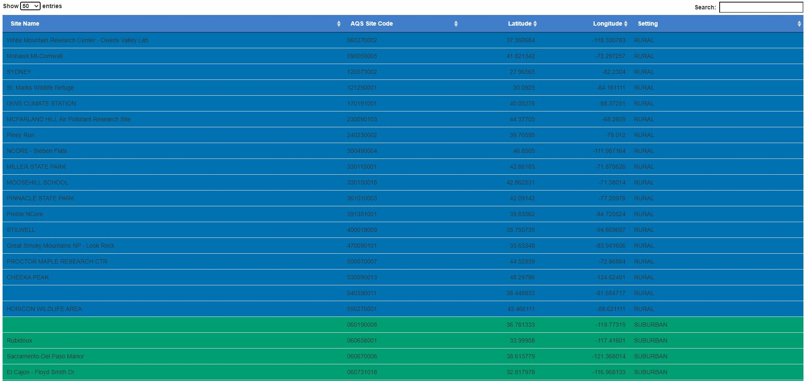

With site selected (filter applied):

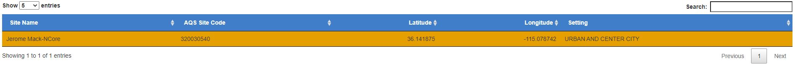


**Example 2**

- NCore Site and Method Summary table
- Filtered by sitecode selected on map ('320030540' in below example) and multiple years
- Rows not colored
- Caption included -- must be reactive value
- UI wrapped in column of width 10

```
ui <- fluidPage(
     column(10, offset = 1,
      tableUI('SiteMethodSummary'))
)

server <- function(input, output, session) {
   tableServer(id='SiteMethodSummary',
              input_data = reactive({siteMethod_final %>% drop_na(tableGroup)}),
              page_length = 25,
              select_cols = c('parameter',
                              'parameter_code',
                              'poc',
                              'sample_duration',
                              'method_code',
                              'method',
                              'method_type',
                              'units_of_measure',
                              'countValid',
                              'countAboveMDL',
                              'avgMDL',
                              'tableGroup'),
              col_label_names = c('Parameter',
                                  'Parameter Code',
                                  'POC',
                                  'Sample Duration',
                                  'Method Code',
                                  'Method',
                                  'Method Type',
                                  'Units',
                                  'Count Valid',
                                  'Count > MDL',
                                  'Avg. MDL',
                                  'Group'),
              color_order = c('Required Gases',
                              'Required PM',
                              'Collocated Measurements',
                              'Required Meteorology',
                              'Ion',
                              'Speciation',
                              'Additional Supporting'),
              filter_col = c('AQS_SITECODE', 'Year'),
              filter_rct = reactive({list(selected_site$sitecode, 
                                          input$SMSYear)}),
              color_col = 'tableGroup',
              cb = reactive({input$color_pal}))
}
```

Yields:

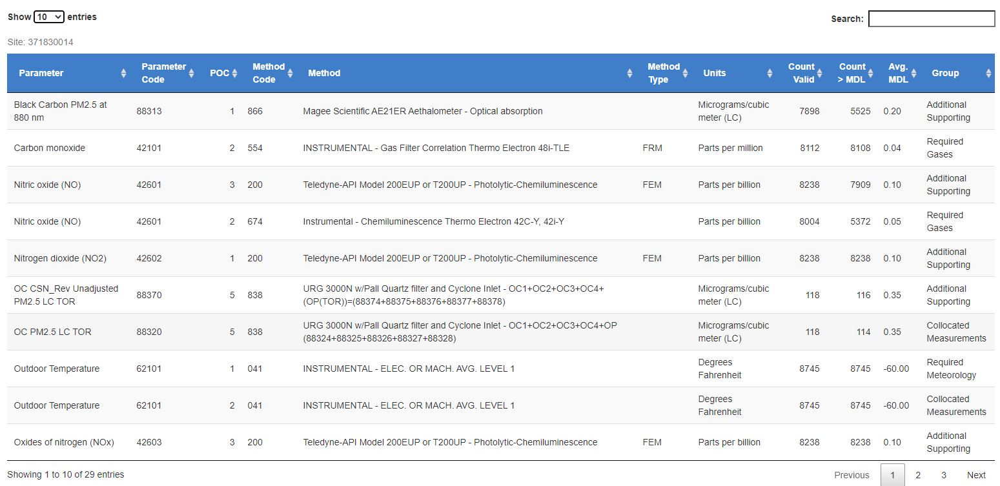

<br><br><br><br>

# timeseries

A timeseries may be rendered by the combination of the `timeseriesUI()` function
in the ui object, and the `timeseriesServer()` function in the server function
of an app.

The timeseries functions can plot up to 2 parameters on the same axes. If two
parameters are specified, a legend is added to the plot.

The server function takes in up to 2 reactive dataframes that should have columns for
x and y values, units of measure, measurement values, and a column for parameter
name (or the name of the value being plotted), and a column for duration that
determines the style of the value that is plotted. 

Duration value must be either '1Hr' (plotted as a line) or '24Hr' (plotted as a point).
The duration of `param_rct` is assumed to be '1Hr' (plotted as a line). The duration
of the optional `sec_param_rct` must be specified in the argument `sec_duration_rct`.

The y-axis labels include the parameter and its units.

Line and point size may be adjusted via function arguments "linesize` and `pointsize`.

The plot is "zoomable". The UI function includes brush/double-click functionality. To zoom in on an area of the plot,
a user can brush a box over the desired area and double click to submit. To reset the zoom,
double-click again.

The Server function **returns the plot brush**, so the extent of the x and y
axes may be passed to other functions that accept a brush (see scatter and pollutionRose sections).

The UI is wrapped in a column of width 10, offset by 1.

### Docstring parameters

**Note: The following arguments must be reactive values, and wrapped in shiny::reactive() in the function call to timeseriesServer()**

- input_data
- param_rct
- sec_param_rct
- sec_duration_rct

timeseriesUI():

```
#' @param id string ID label that links timeseriesUI() to timeseriesServer()
```

timeseriesServer():

```
#' @param id string ID label that links timeseriesUI() to timeseriesServer()
#' @param id string ID label that links timeseriesUI() to timeseriesServer()
#' @param data_param1_rct reactive Reactive hourly data
#' @param data_param2_rct reactive (optional) Reactive data (either 1hr or 24hr)
#'                                 for the optionally specified sec_param_rct.
#'                                 Should have the same columns as
#'                                 data_param1_rct.
#' @param x string Column name of datetime value (POSIXct format)
#' @param y string Column name of concentration values
#' @param param_col string Column name of parameter values
#' @param unit_col string Column name of unit values
#' @param param_rct reactive String value of primary parameter to display
#' @param sec_param_rct reactive (optional) String value of secondary parameter
#'                               to display. If not specified, only 1 parameter
#'                               (param_rct) is displayed.
#' @param sec_duration_rct reactive (optional) Duration of secondary parameter.
#'                                   Either '1Hr' or '24Hr'. If `sec_param_rct`
#'                                   is specified, this must also be specified.
#' @param linesize numeric (optional) Size of plotted line (default = 0.5)
#' @param pointsize numeric (optional) Size of plotted points (default = 3)
```


### Returns

A brush object, with the "current" x- and y-axis limits that are updated when a
user zooms the plot. The brush is a list with values \$xmin, \$xmax, \$ymin, $ymax.

**Call to server function must be saved as a variable to access returned brush**

e.g.

```
brush <- timeseriesServer(...)

# Access values
brush$xmin
brush$xmax
brush$ymin
brush$ymax
```

Use case:

The brush may be passed to other functions that accept a brush as an argument 
(see scatter and pollutionRose sections) to adjust the data shown across
multiple plots based on a user's interaction with the timeseries. This interaction between
plots is used in the timeseriesInvestigationTab wrapper function (see timeseriesInvestigationTab section).


### Examples

All examples use NCore data loaded from the .RData file (See "Access Example Data" section).

**Note: The following arguments must be reactive values, and wrapped in shiny::reactive() in the function call to timeseriesServer()**

- data_param1_rct
- data_param2_rct
- param_rct
- sec_param_rct
- sec_duration_rct

<br>

**Example 1**

- Single (1hr, assumed) parameter plotted
- Plotted as a solid line, no legend
- Brush (return value) saved in variable named TS_brush -- TS_brush has values \$xmin,\$xmax,\$ymin,$ymax.

```
ui <- fluidPage(
  timeseriesUI('TS')
)

server <- function(input, output, session) {
  TS_brush <- timeseriesServer(id='TS',
                               data_param1_rct = reactive({TS_1hr_data %>% 
                                          filter(AQS_SITECODE == '320030540')}),
                               x='date_time2',
                               y='sample_measurement',
                               param_col = 'parameter',
                               unit_col = 'units_of_measure',
                               param_rct = reactive({'Ozone'}))
}
```

Yields:

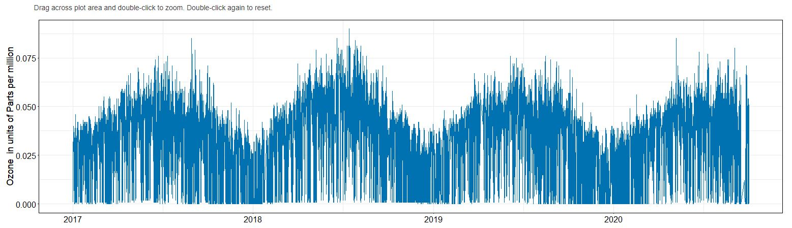

**Example 2**

- Two 1-hr parameters plotted
- "Primary" parameter plotted as solid line. "Secondary" as dashed line.
- Line size increased to size 0.75
- Legend appears when 2 parameters plotted

```
ui <- fluidPage(
  
)

server <- function(input, output, session) {
  TS_brush <- timeseriesServer(id='TS',
                               data_param1_rct = reactive({TS_1hr_data %>% 
                                          filter(AQS_SITECODE == '320030540',
                                                 parameter_code == '44201'}),
                               data_param2_rct = reactive({TS_1hr_data %>% 
                                          filter(AQS_SITECODE == '320030540',
                                                 parameter_code == '42101'}),
                               x='date_time2',
                               y='sample_measurement',
                               param_col = 'parameter',
                               unit_col = 'units_of_measure',
                               param_rct = reactive({'Ozone'}),
                               linesize=0.75,
                               sec_param_rct = reactive({'Carbon monoxide'}),
                               sec_duration_rct = reactive({'1Hr'}))
}
```

Yields:

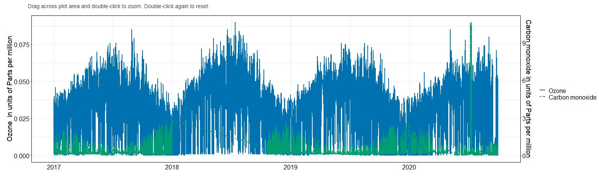

**Example 3**

- Two parameters plotted, primary = 1-Hour, secondary = 24-Hour
- data_24hr_rct must be specified
- "Primary" parameter plotted as solid line. "Secondary" as points.
- Line size increased to size 0.75. Point size set to 3.
- Legend appears when 2 parameters plotted

```
ui <- fluidPage(
  
)

server <- function(input, output, session) {
  TS_brush <- timeseriesServer(id='TS',
                               data_param1_rct = reactive({TS_1hr_data %>% 
                                          filter(AQS_SITECODE == '320030540',
                                                 parameter_code == '44201'}),
                               data_param1_rct = reactive({TS_24hr_data %>% 
                                          filter(AQS_SITECODE == '320030540',
                                                 parameter_code == '42101'}),
                               x='date_time2',
                               y='sample_measurement',
                               param_col = 'parameter',
                               unit_col = 'units_of_measure',
                               param_rct = reactive({'Ozone'}),
                               linesize=0.75,
                               pointsize = 3,
                               sec_param_rct = reactive({'Carbon Monoxide'}),
                               sec_duration_rct = reactive({'24Hr'}))
}
```

Yields:

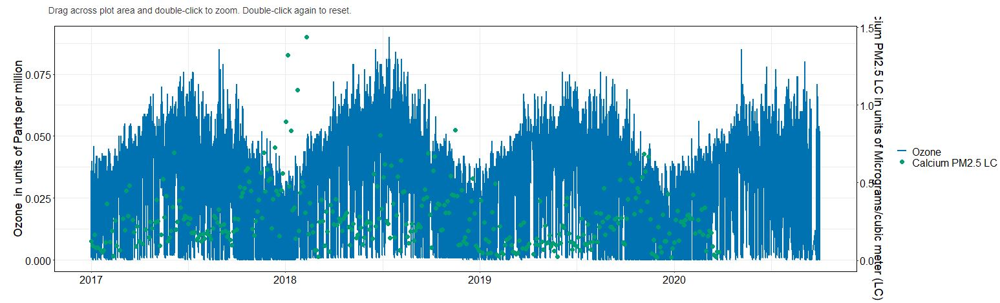

**Example 4**

- UI selectors for site, param1, param2 and duration2 included in ui object
- These selections passed to `param_rct`, `sec_param_rct` and `sec_duration_rct` respectively
-

```
ui <- fluidPage(
              selectInput('sitecode',
                          label = 'AQS Sitecode',
                          choices = c('320030540', '160010010')
                          ),
              selectInput('param1',
                          label = 'Parameter 1',
                          choices = c('Ozone', 'PM2.5 - Local Conditions')
                          ),
              selectInput('param2',
                          label = 'Parameter 2',
                          choices = c('Carbon monoxide', 'Aluminum PM2.5 LC')
                          ),
              selectInput('duration2',
                          label = 'Secondary Duration',
                          choices = c('1Hr', '24Hr')
                          ),
             timeseriesUI('TS')
)

server <- function(input, output, session) {
    TS_brush <- timeseriesServer(id='TS',
                               data_param2_rct = reactive({TS_1hr_data %>% 
                                       filter(AQS_SITECODE == input$sitecode,
                                       parameter == input$param1)}),
                               data_param2_rct = reactive({TS_24hr_data %>% 
                                       filter(AQS_SITECODE == input$sitecode,
                                       parameter == input$param2)}),
                               x='date_time2',
                               y='sample_measurement',
                               param_col = 'parameter',
                               unit_col = 'units_of_measure',
                               param_rct = reactive({input$param1}),
                               sec_param_rct = reactive({input$param2}),
                               sec_duration_rct = reactive({input$duration2}))
}
```

Yields:

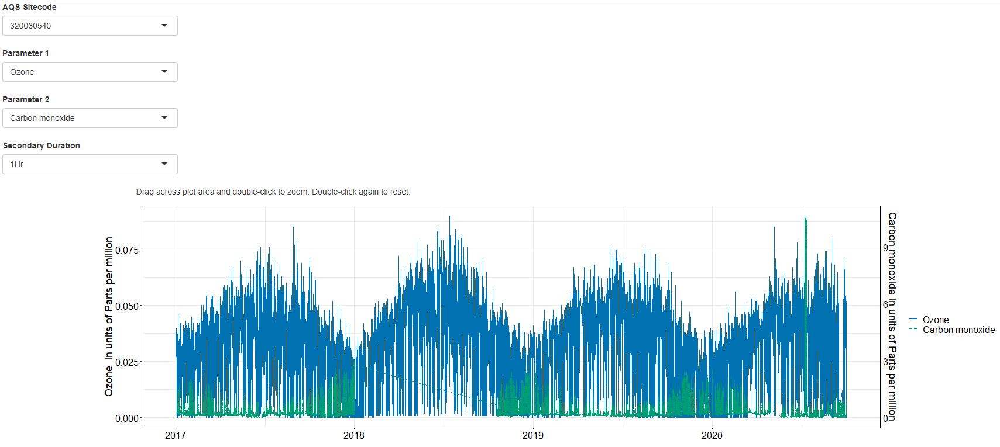


<br><br><br><br>

# pollutionRoseTab

A wrapper for the pollutionRose function that creates an interactive set of
UI components, including multi-select menus for Year, Season, and Metric (AQI or concentration).

The UI menu may be configured to show:

- Multi-select season menu
- Multi-select year filter
- Metric display (Concentrations or AQI)
- Whether 1 or 2 roses are displayed

Up to four pollution roses for selected parameters are plotted below these
menus.

Either concentration values or AQI categories may be plotted.

The Server function accepts a reactive dataframe in wide format that contains
both concentration and wind data. It should have columns for

- wind direction
- wind speed
- concentrations for parameter 1
- concentrations for parameter 2 (optional)
- concentrations for parameter 3 (optional)
- concentrations for parameter 4 (optional)
- site
- year (optional)
- season (optional)

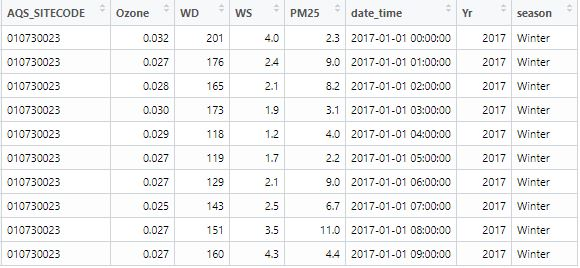

`title_1/2/3/4` Are used to set the plot titles. These may be `r` expressions
to facilitate subscripts, greek letters, etc.

By passing a `site_rct` value, the dataframe is filtered to that value via
`site_col`.

The UI function spaces/aligns all menus and plot layouts.

### Docstring parameters

**Note: The following arguments must be reactive values, and wrapped in shiny::reactive() in the function call to pollutionRoseTabServer()**

- input_data
- map_data
- title_1/2/3/4 
- site_rct


pollutionRoseTabUI():

```
#' @param id string ID used to link pollutionRoseTabUI() to 
#'           pollutionRoseTabServer()
#' @param season_filter boolean If TRUE, multi-select input for season is added.
#'                              Seasons include spring, summer, fall, winter.
#' @param year_filter boolean If TRUE, multi-select input for year is added.
#'                              Years range from 2019-2020.
#' @param metric_filter boolean If TRUE (default), Option to display AQI or
#'                              concentration values is added.
#' @param num_plots integer Number of plots to show on the PR tab. Maximum of 4.
```

pollutionRoseTabServer():

```
#' Pollution rose tab UI
#'
#' Used alongside pollutionRoseTabUI() to add a collection of reactive
#' elements to an app, including multiselects for seasons and years, a select
#' for metric type (aqi or concentration), and up to 2 pollution roses for
#' two specified parameters.
#'
#' @param id string ID used to link pollutionRoseTabUI() to pollutionRoseTabServer()
#' @param input_data reactive data.frame Dataframe with concentration data for
#'                   all input parameters as well as a column with wind
#'                   direction, and a column with wind speed (speed can be
#'                   all NAs if plotting pollution rose)
#' @param map_data reactive data.frame Dataframe with lat and lng columns
#'                                     with the location of program sites,
#'                                     to be plotted on a leaflet map.
#' @param wd_col string Column name for column with wind direction values
#' @param ws_col string Column name for column with wind speed values
#' @param conc_col_1 string Column name for column with concentration values
#'                          for title_1
#' @param conc_col_2 string Column name for column with concentration values
#'                          for title_2
#' @param conc_col_3 string Column name for column with concentration values
#'                          for title_3
#' @param conc_col_4 string Column name for column with concentration values
#'                          for title_4
#' @param site_rct reactive string AQS sitecode for selected site
#' @param site_col string Column name for column with AQS sitecode values
#' @param unit_str_1 string Unit of title_1. Can be an expression.
#' @param unit_str_2 (optional) string Unit of optional title_2. Can be an expression.
#' @param unit_str_3 (optional) string Unit of optional title_3. Can be an expression.
#' @param unit_str_4 (optional) string Unit of optional title_4. Can be an expression.
#' @param title_1 reactive string Name of first parameter to include in plot title
#'                             (can be an expression if subscripts needed).
#' @param title_2 reactive string (optional) Name of optional second parameter 
#'                                to include in plot title
#'                             (can be an expression if subscripts needed).
#' @param title_3 reactive string (optional) Name of optional second parameter 
#'                                to include in plot title
#'                             (can be an expression if subscripts needed).
#' @param title_4 reactive string (optional) Name of optional second parameter 
#                                 to include in plot title
#'                             (can be an expression if subscripts needed).
#' @param year_filter boolean If true, multi-select year input included and
#'                            plots may be filtered by year.
#' @param year_col string (optional) Column name of column with year values 
#'                        if year_filter specified.
#' @param season_filter boolean If true, multi-select season input included and
#'                            plots may be filtered by season.
#' @param season_col string (optional) Column name of column with season values 
#'                          if season_filter specified.
#' @param breaks_conc_1 vector (optional) Manual scale breaks in legend for first
#'                                 parameter. If not specified, sequence of
#'                                 6 equal breaks will be created with endpoints
#'                                 at the max and min concentration value.
#' @param breaks_aqi_1 vector Manual scale breaks for AQI designations for first
#'                            parameter.
#' @param breaks_conc_2 (optional) Manual scale breaks in legend for optional 
#'                                 second parameter. If not specified, sequence of
#'                                 6 equal breaks will be created with endpoints
#'                                 at the max and min concentration value.
#' @param breaks_aqi_2 (optional) vector Manual scale breaks for AQI designations 
#'                                for optional second parameter.
#' @param breaks_conc_3 vector (optional) Manual scale breaks in legend for first
#'                                 parameter. If not specified, sequence of
#'                                 6 equal breaks will be created with endpoints
#'                                 at the max and min concentration value.
#' @param breaks_aqi_3 vector Manual scale breaks for AQI designations for first
#'                            parameter.
#' @param breaks_conc_4 (optional) Manual scale breaks in legend for optional second
#'                                 parameter. If not specified, sequence of
#'                                 6 equal breaks will be created with endpoints
#'                                 at the max and min concentration value.
#' @param breaks_aqi_4 (optional) vector Manual scale breaks for AQI designations for
#'                                optional second parameter.
#' @param aqipalette vector Standard color palette for aqi categories with elements:
#'                   - aqipalette$greenGood,
#'                   - aqipalette$yellowModerate,
#'                   - aqipalette$orangeUSG,
#'                   - aqipalette$redUnhealthy,
#'                   - aqipalette$purpleVeryUnhealthy,
#'                   - aqipalette$maroonHazardous
```

### Examples

All examples use NCore data loaded from the .RData file (See "Access Example Data" section).

**Note: The following arguments must be reactive values, and wrapped in shiny::reactive() in the function call to  pollutionRoseTabServer()**

- input_data
- map_data
- title_1/2/3/4 
- site_rct

<br>

**Example 1**

- NCore pollution rose tab
- $Ozone$ and $PM_{2.5}$ plotted
- Expressions passed to param_rct_2 and unit_str_2.

```
ui <- fluidPage(
  pollutionRoseTabUI('PR')
)

server <- function(input, output, session) {
  pollutionRoseTabServer(id = 'PR',
                         input_data = reactive({poll_rose}),
                         map_data = reactive({map_obj$sitedata}),
                         wd_col = 'WD',
                         ws_col = 'WS',
                         site_col = 'AQS_SITECODE',
                         site_rct = reactive({selected_site$sitecode}),
                         conc_col_1 = 'Ozone',
                         unit_str_1 = 'ppm',
                         title_1 = reactive({'Ozone'}),
                         conc_col_2 = 'PM25',
                         unit_str_2 = 'mu*g/m^3',
                         title_2 = reactive({'PM[2.5]'}),
                         year_filter = TRUE,
                         year_col = 'Yr',
                         season_filter = TRUE,
                         season_col = 'season',
                         breaks_conc_1 = c(0, 0.010, 0.025, 0.040, 0.055, 
                                           0.060, 0.075, 0.090, 0.105),
                         breaks_aqi_1 = c(0, 0.054, 0.070, 0.085, 0.105, 
                                          0.200, 0.604),
                         breaks_conc_2 = c(0, 2, 5, 10, 15, 20, 35, 50, 100),
                         breaks_aqi_2 = c(0, 12.0, 35.4, 55.4, 150.4, 250.4, 
                                          500.4),
                         aqipalette = aqipalette)
}
```

Yields:

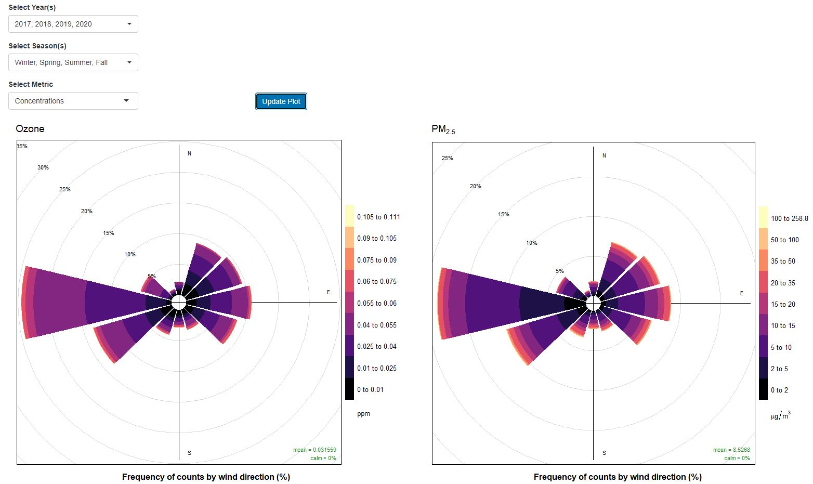

<br><br><br><br>

# timeseriesInvestigationTab

The timeseriesInvestigationTab functions create a set of UI elements and
wraps the standalone timeseries, pollutionRose, and scatter functions 
(see timeseries, pollutionRose, and scatter sections) so that reactivity
between the three is linked.

The call to timeseriesInvestigationTabServer() requires that a user pass
all arguments needed by the 3 wrapped plotting functions.

It requires 3 dataframes:

- 1 hour concentration data
- 24 hour concentration data
- Wind data
- 24 hr wind data

The two concentration dataframes should have the same column names for:

- datetime
- units of measure
- parameter name
- site
- measurement values

The wind dataframes should share column names with the concentration data for:

- datetime
- site
- param_col

The wind data will be joined to concentration data by datetime, parameter, and site.

The server function requires a list of 1-hour and 24-hour parameters to 
set values for drop-down menus.

The pollutionrose will only appear if a 1-hour parameter is selected.
The scatterplot will only appear if two 1-hour parameters are selected.

The UI is fully formatted/aligned.

See each individual function section for more details.

### Docstring parameters

**Note: The following arguments must be reactive values, and wrapped in shiny::reactive() in the function call to timeseriesInvestigationTabServer()**

- data_1hr_rct
- data_24hr_rct
- data_1hr_wind_rct
- data_24hr_wind_rct
- selected_site_rct
- paramlist_1hr_rct
- paramlist_24hr_rct

timeseriesInvestigationTabUI():

```
#' @param id string ID the connects timeseriesInvestigationTabUI() to 
#'                  timeseriesInvestigationTabServer()
```

timeseriesInvestigationTabServer():

```
#' @param id string ID the connects timeseriesInvestigationTabUI() to 
#'                  timeseriesInvestigationTabServer()
#' @param data_1hr_rct reactive data.frame 1-hr concentration data with columns
#'                                         for datetime, parameter name, units,
#'                                         concentration measurements, sitecode.
#' @param data_24hr_rct reactive data.frame 24-hr concentration data with 
#'                               columns for datetime, parameter name, units,
#'                                         concentration measurements, sitecode.
#' @param data_1hrwind_rct reactive data.frame 1hr Wind data with columns
#'                                         for datetime, sitecode, wind 
#'                                         direction,
#'                                         wind speed.
#' @param data_24hrwind_rct reactive data.frame 24hr Wind data with columns
#'                                         for datetime, sitecode, wind 
#'                                         direction,
#'                                         wind speed.
#' @param selected_site_rct reactive string Selected AQS Sitecode
#' @param paramlist_1hr_rct reactive vector List of 1hr parameters for selected 
#'                                          site
#' @param paramlist_24hr_rct reactive vector List of 24hr parameters for 
#'                                           selected site
#' @param dt_col string Name of datetime column in concentration data
#' @param param_col string Name of column with parameter name values in 
#                          concentration AND wind data
#' @param unit_col string Name of column with unit values in concentration data
#' @param measurement_col string Name of concentration column for timeseries
#' @param wd_col string Name of column in wind data with direction values
#' @param ws_col string Name of column in wind data with speed values
#' @param site_col string Name of column in wind AND concentration data with 
#'                        values of AQS sitecode.
#' @param poc_col string Column name of column with poc number.
#' @param wd_col string Name of column in wind data with direction values
#' @param ws_col string Name of column in wind data with speed values
#' @param site_col string Name of column in wind AND concentration data with values
#'                        of AQS sitecode.
#' @param linesize numeric (optional) Size of plotted line (default = .5) on TS.
#' @param pointsize numeric (optional) Size of points (default = 3) on TS.
```


### Examples

All examples use NCore data loaded from the .RData file (See "Access Example Data" section).

**Note: The following arguments must be reactive values, and wrapped in shiny::reactive() in the function call to timeseriesInvestigationTabServer()**

- data_1hr_rct
- data_24hr_rct
- data_1hr_wind_rct
- data_24hr_wind_rct
- selected_site_rct
- paramlist_1hr_rct
- paramlist_24hr_rct
 
<br>

**Example 1** 

```
ui <- fluidPage(
  timeseriesInvestigationTabUI('TSTab'))
)

server <- function(input, output, session) {
  timeseriesInvestigationTabServer(id='TSTab',
                                   data_1hr_rct=reactive({TS_1hr_data}),
                                   data_24hr_rct=reactive({TS_24hr_data}),
                                   data_1hr_wind_rct=reactive({WD_step1}),
                                   data_24hr_wind_rct = reactive({WD_24hr}),
                                   selected_site_rct=reactive({
                                                      selected_site$sitecode}),
                                   paramlist_1hr_rct=reactive({
                                   selected_site$paramlist_1hr}),
                                   paramlist_24hr_rct=reactive({
                                                selected_site$paramlist_24hr}),
                                   dt_col = 'date_time2',
                                   param_col = 'parameter',
                                   unit_col = 'units_of_measure',
                                   measurement_col = 'sample_measurement',
                                   poc_col = 'poc',
                                   wd_col = 'WD',
                                   ws_col = 'WS',
                                   site_col = 'AQS_SITECODE')
}
```

<br><br><br><br>

# mapSelectHeader

**Calls to these functions operate differently from the modules above to facilitate
setting multiple output elements to the same object. mapSelectHeader() does not take 
id as an argument, but instead must be assigned to an output element with the
id specified in the call to mapSelectHeaderUI()**

Creates the header table, held within a well panel, at the top of a tab that
requires a map-click to display (e.g. any site-specific tab).

The columns and column headers displayed may be specified.

### Docstring parameters

**Note: The following arguments must be reactive values, and wrapped in shiny::reactive() in the function call to timeseriesInvestigationTabServer()**

- data_row

mapSelectHeaderUI():

```
#' @param labelId string ID the connects stored variable of call to mapSelectHeader()
```

mapSelectHeader():

```
#' @param data_row reactive Row of data to be displayed, e.g. the $sitedata
#'                          output of sitemapServer()
#' @param select_cols character vector Columns to display in table
#' @param col_labels character vector Column labels to display in table
```


### Examples

All examples use NCore data loaded from the .RData file (See "Access Example Data" section).

**Note: The following arguments must be reactive values, and wrapped in shiny::reactive() in the function call to mapSelectHeader()**

- data_row

**Example 1**

- simple call to mapSelectHeader

```
ui <- fluidPage(
  mapSelectHeaderUI('SelectedSite')
)

server <- function(input, output, session) {
  output$SelectedSite <- mapSelectHeader(data_row = reactive({NCore_simple %>%
                                                               filter(AQS_SITECODE == '320030540')}),
                                         select_cols = c('AQS_SITECODE',
                                                         'local_site_name'),
                                         col_labels = c('AQS Site Code',
                                                        'Site Name'))
}
```

**Example 2**

- Setting multiple output objects to same function call (output$SelectedSiteTab1/2/3 all set to single call to mapSelectHeader())

```
ui <- fluidPage(
  shiny::tabsetPanel(id == 'Tabs',
    shiny::tabPanel(id = 'Tab 1',
      mapSelectHeaderUI('SelectedSiteTab1')
                    ),
    shiny::tabPanel(id = 'Tab 2',
      mapSelectHeaderUI('SelectedSiteTab2')
                    ),
    shiny::tabPanel(id = 'Tab 3',
      mapSelectHeaderUI('SelectedSiteTab3')
                    ))
)

server <- function(input, output, session) {
  output$SelectedSiteTab1 <-
    output$SelectedSiteTab2 <-
    output$SelectedSiteTab3 <-
      mapSelectHeader(data_row = reactive({NCore_simple %>%
                                           filter(AQS_SITECODE == '320030540')}),
                      select_cols = c('AQS_SITECODE',
                                      'local_site_name'),
                      col_labels = c('AQS Site Code',
                                     'Site Name'))
}
```

# tabColorKey

Creates the key that shows the categories that correspond to each tab color.
Colors shown update depending on colorblind accesible selection.

### Docstring parameters

tabColorKeyUI():

```
#' @param id string Links call to tabColorKeyUI to tabColorKeyServer function
```

tabColorKeyServer():

```
#' @param n integer Number of unique tab colors
#' @param labels character vector Labels to give to each respective tab color
#' @param cb boolean If T, colorblind accessible palette is used
```


### Examples

All examples use NCore data loaded from the .RData file (See "Access Example Data" section).

**Note: The following arguments must be reactive values, and wrapped in shiny::reactive() in the function call to mapSelectHeader()**

- data_row

**Example 1**

- simple call to tabColorKey with 2 colors

```
ui <- fluidPage(
  fluidRow(
      column(3, align = 'right',
             div(style='padding-top:50px; font-size:16px; padding-right:25px',
                 fluidRow(tags$a("View README",href="README_NCORE.pdf",target="_blank")),
                 fluidRow(checkboxGroupInput(inputId = 'color_pal',
                                             choices = c('Accessible Color Palette' = "CB"),
                                             label = NULL))))
    ),
  fluidRow(column(12, align = 'right', tabColorKeyUI('colorKey')))
)

server <- function(input, output, session) {
  colors <- reactiveValues(cb_bool = FALSE)
  
  observe({
    if (!is.null(input$color_pal)) {
        colors$cb_bool = TRUE
    } else {
        colors$cb_bool = FALSE
    }
  })
  
  tabColorKeyServer(id='colorKey',
                    n=2,
                    labels = c('Network-wide',
                               'Site-specific'),
                    cb=reactive({colors$cb_bool}))
}
```


